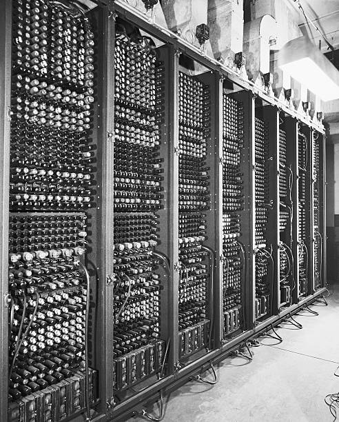
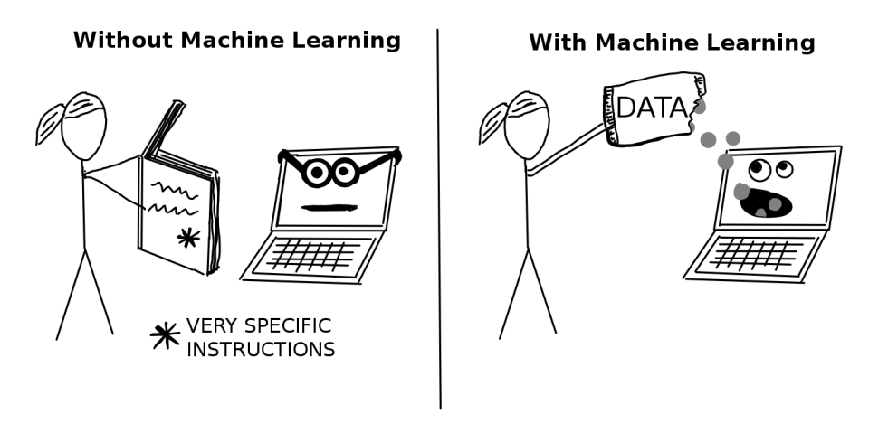

# Machines can Learn!
Since the creation of the computer in 1946, engineers have been innovating and improving on the basic design to the point where these computers are incomparable to those of the past. In the past, computers were considered to be tools to assist people in making complex calculations so that they might to their job better. In more recent years, we have developed computers to the point were we can expect them to do much more complex calculations. The most desirable of which is making decisions.

# Why is Machine Learning Important?
Intelligence is defined as the ability to gain and apply new skills and knowledge. For millennia humans have developed new skills and obtained new knowledge in the pursuit of better living standards in the world. People have learned to discovered forms of medicine not thought, tricked rocks to think, and discovered traveled to the moon. All things that people probably never thought was possible in the past. Imagine the limits that can be broken, as humans have after so many centuries, by computers. In the world, there are many things that we do that take years of practice, predicting whether a tumor is cancerous, driving through rush hour traffic, or defining all the possible solutions to a board game. Computers have allowed us to make these processes much faster and more reliable. From mammograms and x-rays to [bots](https://openai.com/five/) beat professional video game players, computers have grown to do revolutionary things.

# How to Machines Learn?
Engineers have learned that nature can provide us with innovations like velcro which was created by [mimicking burrs of plants](https://www.microphotonics.com/biomimicry-burr-invention-velcro/). Computer engineering makes no exception. Humans have discovered mathematics and made computers that can do it much faster. Just as humans are able to quickly discover patterns in the world, computers should likewise recognize the patterns rapidly. 

Whether you know it or not, the patterns we see in the world are geometrically defined as a repeated sequence of numbers, shapes, colors, etc. Often these sequences are able to be described mathematically. That is where computers come in. By translating problems into an abstraction of math, we can make predictions using data collected from the problem. This abstraction allows computers use mathematical models to solve many different prediction based problems. So there we have it, the goal of modern machine learning (ML) is to find mathematical models that make good predictions. Essentially the same as statistics aside from some minor qualifications that I will not mention in this essay.

# A Deeper Dive
ML can be used to rapidly solve problems that scientists, engineers, doctors, and many other professionals might not be able to, or at least as quickly. Take the example of a physician who gets a visit by a patient who is having issues breathing. This issue could be caused by tons of medical issues and a doctor will usually default to the patients medical history to assist with finding out what is wrong. If the medical history does not paint a clear enough picture, the doctor will continue to run further tests. These tests often include temperature and blood pressure readings, perhaps how often the patient has been coughing, the type of coughs they have, etc. From there, the doctor will make an estimate of what is affecting the patient. Using the same information as a doctor, the computer could generate a model and compare newly collected information to help classify what kind of illness the patient has. 

So what is the difference if the doctor and the computer still need to collect the same data? For the doctor, being able to diagnose patients with the correct ailment takes years of practice and experience to do at a high level, but the learning period for a computer is much shorter and cheaper.

# Real World Examples
Throughout the world, machine learning is used in daily life. By speaking to Siri, watching Netflix, browsing the internet, and checking your Facebook, you are fueling the modern age of ML. Your data is being collected used to train models to help improve their understanding of the world and the people in it.